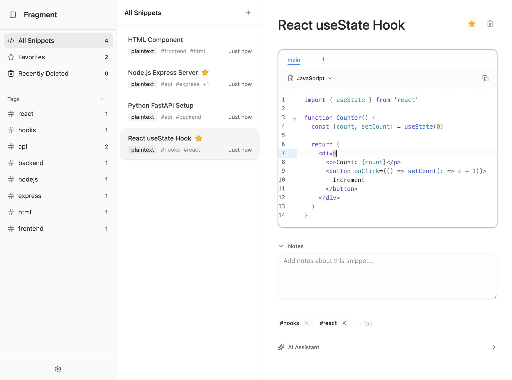
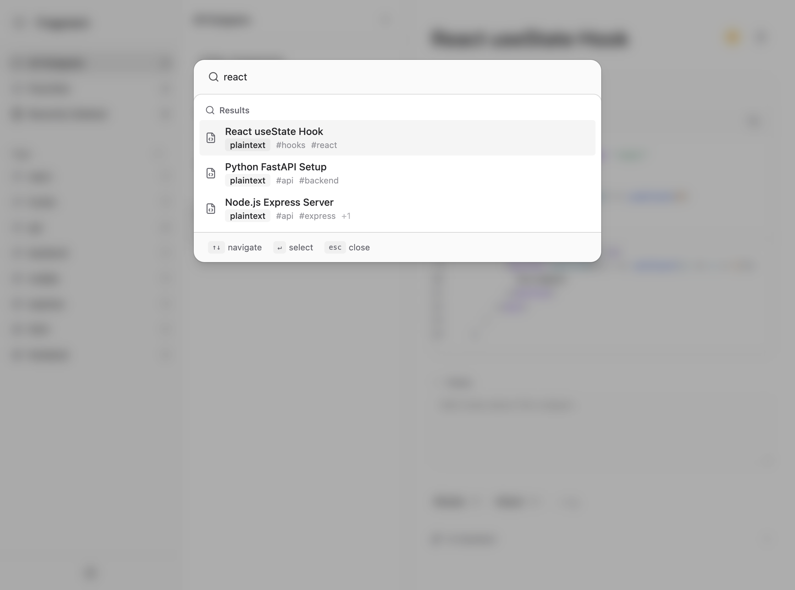
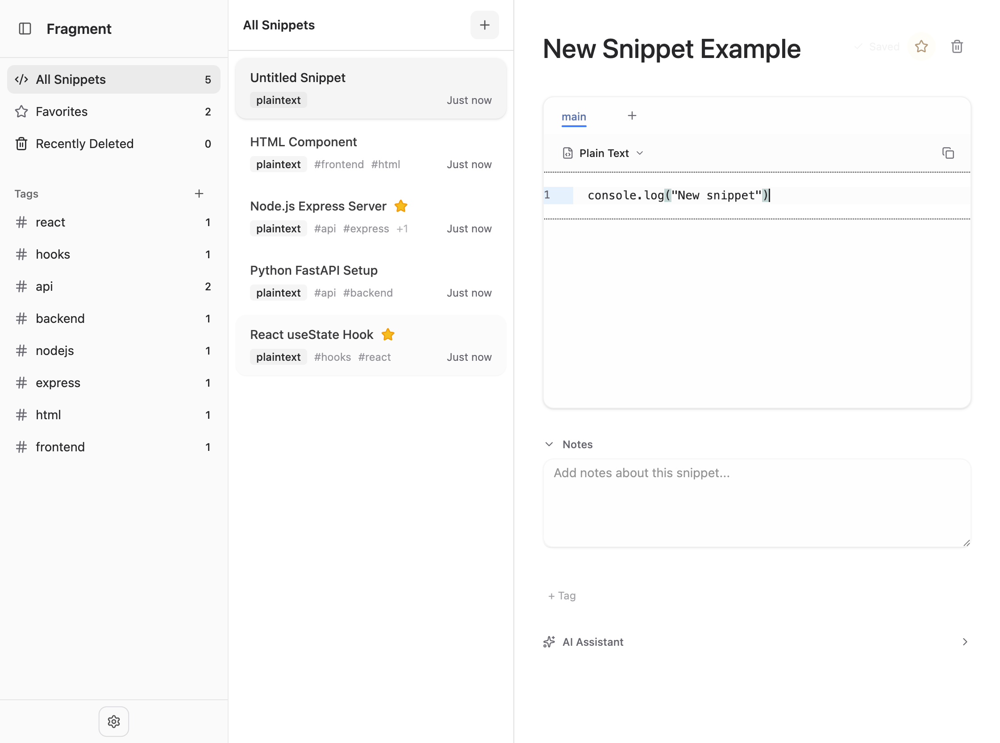
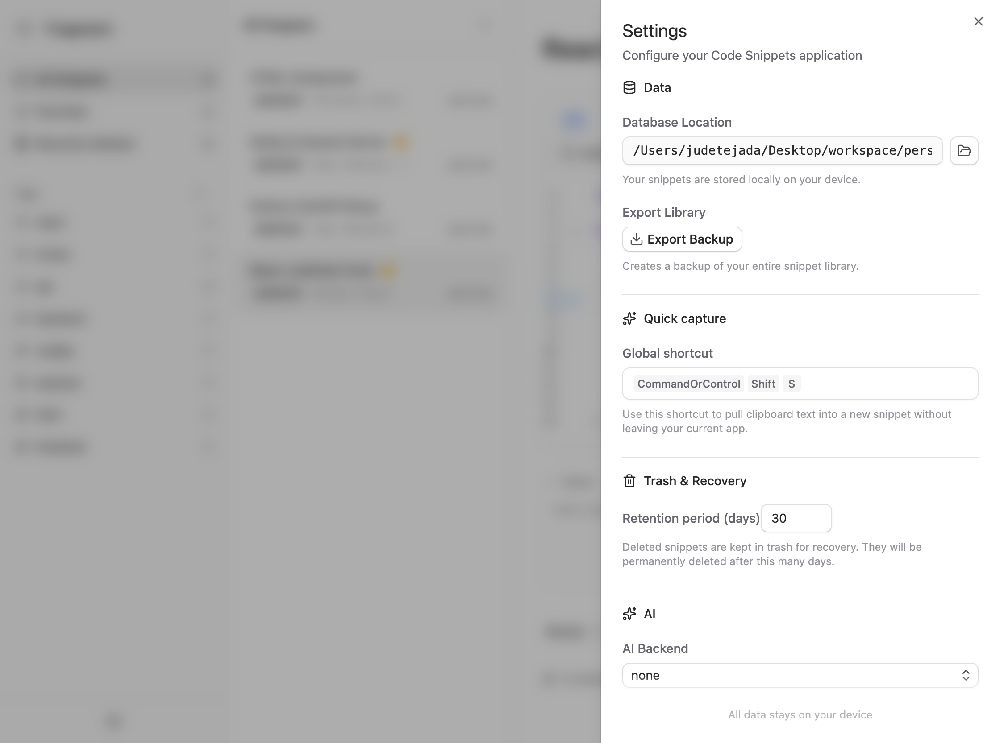

# Fragment

A modern code snippet manager built with Electron, React, and TypeScript. Organize, search, and access your code snippets efficiently.



## Features

- **Snippet Management** - Create, edit, and organize code snippets with syntax highlighting
- **Tag System** - Organize snippets with customizable tags
- **Quick Switcher** - Fast search and navigation with `Cmd/Ctrl + K`
- **Drag & Drop** - Reorder snippets and tags intuitively
- **Fragment Bar** - Quick access to frequently used snippets
- **Settings** - Customizable editor settings and theme
- **Cross-Platform** - Works on Windows, macOS, and Linux

## Tech Stack

- **Electron** - Desktop application framework
- **React 19** - UI component library
- **TypeScript** - Type-safe JavaScript
- **Vite** - Fast build tool and dev server
- **TailwindCSS** - Utility-first CSS
- **SQLite** - Local database storage
- **CodeMirror 6** - Modern code editor
- **Lucide React** - Beautiful icons

## Quick Start

### Prerequisites

- [Bun](https://bun.sh/) runtime (recommended) or Node.js 18+
- macOS, Windows, or Linux

### Installation

```bash
# Clone the repository
git clone https://github.com/yourusername/fragment.git
cd fragment

# Install dependencies
bun install
```

### Development

```bash
# Start development server with hot reload
bun dev
```

### Building

```bash
# Build for current platform
bun build

# Platform-specific builds
bun build:win    # Windows (.exe)
bun build:mac    # macOS (.dmg)
bun build:linux  # Linux (.AppImage)
```

### Code Quality

```bash
# Format code with Prettier
bun format

# Lint with ESLint
bun lint

# Run TypeScript checks
bun typecheck
```

## Project Structure

```
fragment/
├── src/
│   ├── main/           # Electron main process
│   │   └── index.ts    # Window creation, app lifecycle
│   ├── preload/        # Preload script
│   │   └── index.ts    # Context bridge APIs
│   └── renderer/       # React UI
│       └── src/
│           ├── App.tsx                    # Root component
│           ├── components/
│           │   ├── ui/                    # Reusable UI library
│           │   ├── CodeEditor/            # Code editor component
│           │   ├── Sidebar/               # Snippet sidebar
│           │   ├── QuickSwitcher/         # Command palette
│           │   └── Settings/              # Settings modal
│           ├── lib/                       # Utilities & database
│           └── hooks/                     # Custom React hooks
├── tests/
│   ├── e2e/           # Playwright end-to-end tests
│   └── unit/          # Unit tests
├── resources/         # App icons and assets
├── electron-builder.yml  # Packaging config
├── electron.vite.config.ts
└── package.json
```

## Key Features

### Quick Switcher



Press `Cmd+K` (macOS) or `Ctrl+K` (Windows/Linux) to open the quick switcher for instant search across snippets and tags.

### Snippet Editor



Full-featured code editor with syntax highlighting, line numbers, and auto-close brackets.

### Settings



Customize editor font size, tab size, and other preferences.

## Development Notes

- Auto-hides menu bar by default
- DevTools: Press `F12` to toggle
- Context isolation enabled for security
- SQLite database stored locally in user data directory

## Contributing

1. Fork the repository
2. Create a feature branch (`git checkout -b feature/amazing-feature`)
3. Commit changes (`git commit -m 'Add amazing feature'`)
4. Push to branch (`git push origin feature/amazing-feature`)
5. Open a Pull Request

## License

MIT License - see LICENSE file for details
